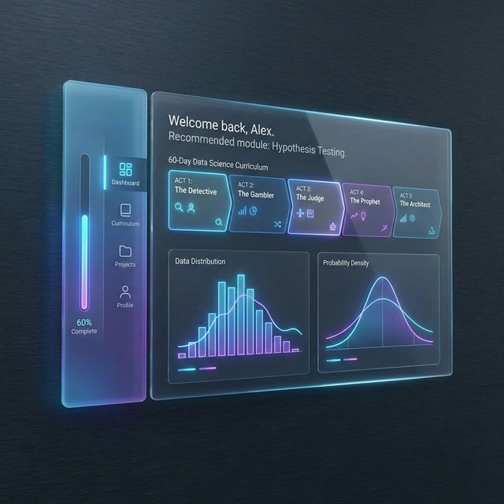

# 📊 Stats Mastery: 60 Days of Data Science

[](https://vitejs.dev/)
[](https://reactjs.org/)
[](https://tailwindcss.com/)
[](https://www.framer.com/motion/)

A premium, interactive learning application designed to take you from zero to mastery in Data Science and Statistics in just 60 days. This platform combines structured curriculum, beautiful visualizations, and AI-powered tutoring to create a world-class educational experience.



## ✨ Core Features

- **🏆 Comprehensive Curriculum**: A 60-day journey divided into 5 "Acts," covering everything from Data Foundations to Machine Learning Architecture.
- **📈 Interactive Visualizations**: Real-time charts and data demonstrations built with Recharts (Histograms, Bell Curves, Box Plots, and more).
- **🤖 AI-Integrated Learning**: Every lesson includes specialized prompts for AI tutors (like Antigravity or ChatGPT) to deepen your understanding.
- **💎 Premium UX**: A glassmorphic, modern interface with smooth animations powered by Framer Motion.
- **📱 Fully Responsive**: Learn anywhere—on your mobile, tablet, or desktop.

## 🗺️ The 60-Day Roadmap

The course is structured as a 5-Act narrative to keep you engaged:

1.  **🕵️ Act I: The Detective (Days 1-12)**: Master the fundamentals of data types, sampling, and Exploratory Data Analysis (EDA).
2.  **🎲 Act II: The Gambler (Days 13-24)**: Conquer probability, distributions, and the math of uncertainty.
3.  **⚖️ Act III: The Judge (Days 25-36)**: Learn the art of inference, hypothesis testing, and A/B experiments.
4.  **🔮 Act IV: The Prophet (Days 37-48)**: Prediction through correlation, linear regression, and logistic modeling.
5.  **🏗️ Act V: The Architect (Days 49-60)**: Final engineering of Machine Learning models, ethics, and future roadmaps.

## 🛠️ Tech Stack

- **Framework**: [React 19](https://react.dev/) + [Vite](https://vitejs.dev/)
- **State/Routing**: [React Router 7](https://reactrouter.com/)
- **Styling**: [Tailwind CSS v4](https://tailwindcss.com/)
- **Animations**: [Framer Motion](https://www.framer.com/motion/)
- **Charts**: [Recharts](https://recharts.org/)
- **Icons**: [Lucide React](https://lucide.dev/)

## 🚀 Getting Started

### Local Development

1.  **Clone the repository**:
    ```bash
    git clone https://github.com/dineshmahapatra123/my-stats-course.git
    cd my-stats-course
    ```

2.  **Install dependencies**:
    ```bash
    npm install
    ```

3.  **Run the development server**:
    ```bash
    npm run dev
    ```

4.  **Open your browser**:
    Navigate to `http://localhost:5173`.

### Deployment

This project is optimized for **GitHub Pages**.

1.  Update `base` in `vite.config.js` to match your repository name:
    ```js
    export default defineConfig({
      plugins: [react()],
      base: '/my-stats-course/',
    })
    ```
2.  Push to the `main` branch. The included GitHub Action will automatically build and deploy the app.

## 📄 License

This project is private and intended for educational purposes.

---

*Built with ❤️ for the future Data Scientists.*
